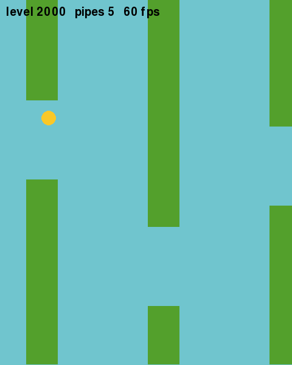

# Neuroevolution of a Flappy Bird Controller

A genetic algorithm (GA) learns to play Flappy Bird. This repo holds the code, the raw logs of
606 training runs, the figures and the paper:
*Neuroevolution of a Flappy Bird Controller: An Empirical Study of Genetic Operators,
Evaluation Noise and Generalisation* (`Flappy_Bird_Neuroevolution_Paper.pdf`).



**Step-by-step run guide (PDF): [`docs/How_to_Run.pdf`](docs/How_to_Run.pdf)**

---

## Quick start

```bash
git clone https://github.com/Anish-185/FlappyBirdAI.git
cd FlappyBirdAI
python -m venv .venv
source .venv/bin/activate            # Windows: .venv\Scripts\activate
pip install -r requirements.txt

python play.py                       # watch the trained bird fly
python analysis.py                   # statistics for every experiment
python figures.py                    # regenerate figures/
python build_paper.py                # regenerate the paper PDF
python experiments.py                # retrain everything (only does work if logs/ is empty)
```

The repo ships with every training log, so you can start with `play.py`, `analysis.py`,
`figures.py` and `build_paper.py` straight away. Retraining is optional and takes about 45 minutes.

---

## What the project does

### The game (`game/engine.py`)

A headless Flappy Bird simulator compiled with [numba](https://numba.pydata.org/). The bird is at a fixed
x position. Gravity pulls it down, and a flap sets its vertical speed to -7.5. Pipes scroll left
at 3 px per frame, 200 px apart, each with a 130 px gap. An episode ends when the bird hits a pipe, the
ground or the ceiling, or survives 10,000 frames.

Each **level** is a random-number seed that fixes the height of every gap, so the same seed always
produces the same level. There are two worlds (`game/worlds.py`):

| World | Gap centres | Purpose |
|---|---|---|
| `hard` | uniform in 150-450 px | main testbed |
| `standard` | uniform in 200-400 px | easier variant (turned out too easy to separate methods) |

The GA calls only `eval_batch(genomes, seeds) -> (frames, pipes, death cause, flaps, proximity)`.

### The brain

Each bird is controlled by one of two "brains", and the genome is that brain's list of numbers:

- **Neural network (default):** a 5-6-1 network with 43 weights. Its 5 inputs are the bird's height,
  its vertical speed, the distance to the next pipe, and the distances to the top and bottom of the gap.
  It flaps if the output is positive.
- **2-gene rule (`mode=1`):** a hand-designed rule that flaps when
  `(y - gap)/50 + g1*v/5 > g0`. It's used to ask whether the network is even needed.

### The genetic algorithm (`ga/evolve.py`)

Each generation scores every genome on K = 3 training levels and keeps the **worst** of the three
as its fitness, so a bird can't win by getting lucky on one level. It then:

1. keeps the 2 best birds unchanged (**elitism**),
2. picks parents (**selection**: tournament / roulette / rank),
3. mixes their genomes (**crossover**: none / single-point / uniform / arithmetic),
4. randomly perturbs the genes (**mutation**: gaussian / random reset / annealed).

All settings live in the `Config` dataclass: population 50, 100 generations, tournament of 3,
uniform crossover at 0.85, gaussian mutation rate 0.10 with sigma 0.30. There are also optional
diversity mechanisms: **fitness sharing** (`sharing=radius`) and **random immigrants** (`immigrants=fraction`).

The default **fitness** is `1000 x pipes + frames + 50 x proximity - 300 x (hit the ceiling)`.
Proximity rewards passing near the centre of each gap.

### Baselines (`ga/baselines.py`)

- **Random search:** sample random genomes and keep the best one ever seen.
- **(1+1) hill climber:** mutate one genome and keep the child if it's at least as good.

Both get exactly the same budget as the GA.

### Fair-comparison protocol

- **Same budget:** every condition gets 15,000 episode evaluations
  (population x levels per evaluation x generations is kept constant).
- **Three separate sets of levels:**
  - training levels (5000+) drive selection,
  - validation levels (1000-1005) are only used for learning curves,
  - test levels (2000-2029) are used **once**, on the final champion. All reported scores come from these.
- **Seeds:** 12 independent runs per condition (algorithm seeds 100-111). Pilot runs used different
  seeds, so no condition was tuned on the data it's reported on.
- **Statistics:** Mann-Whitney U tests, Cliff's delta effect sizes, and Holm correction for multiple comparisons.

### The experiments (`experiments.py`)

There are 60 conditions in total. Each one changes a single setting from the baseline `base`:

| Study | Conditions | Question |
|---|---|---|
| A selection | `sel_roulette`, `sel_tour2`, `sel_tour5`, `sel_rank` | Does the parent-selection scheme matter? |
| B crossover | `cx_none`, `cx_single`, `cx_arith` | Does recombination help? |
| C mutation | `mut_r*_s*` (5 x 4 grid), `mut_annealed`, `mut_reset` | Mutation rate and size |
| D population | `pop_20/100/200`, `elite_0/1/5/10` | Population size and elitism at equal budget |
| E evaluation | `fit_frames`, `fit_pipes`, `agg_mean`, `K1`, `K5`, `pool_1/3/100` | Fitness design, noise, number of training levels |
| F diversity | `div_ctrl`, `div_share1-4`, `div_imm10/20` | Can sharing or immigrants rescue a greedy GA? |
| reference | `rs`, `hc`, `rule_ga` | Random search, hill climber, 2-gene rule |
| easier world | `std_*` | Do the results hold when the game is easier? |

---

## Headline results

Median pipes cleared on 30 unseen levels in the hard world:

| Method | Median pipes | vs. base GA |
|---|---:|---|
| GA, 43-gene network (`base`) | 91.3 | beats random search (delta = -0.90, p_holm = 0.001) |
| (1+1) hill climber | 61.7 | not distinguishable (p_holm = 0.60) |
| GA, 2-gene rule | 84.2 | not distinguishable (p_holm = 0.60) |
| random search | 9.5 | |
| training on 1 level | 54.2 | much worse than 10 levels (delta = -0.89, p_holm = 0.001) |
| greedy config (`div_ctrl`) | 25.2 | diversity collapses 5.34 -> 0.12 |
| + fitness sharing r = 3 | 80.6 | delta = 0.71, p_holm = 0.021 (see reproducibility note) |

None of the selection, crossover or mutation settings made a difference that survived Holm correction.
What mattered was **how many levels the bird trains on** and **keeping the population diverse**.

---

## Repository layout

```
game/engine.py        numba simulator; eval_batch() is the only entry point the GA uses
game/worlds.py        the two worlds (hard / standard)
ga/evolve.py          Config, genetic operators, diversity metric, one GA run
ga/baselines.py       random search and (1+1) hill climber, budget-matched
experiments.py        all 60 conditions; resumable, writes logs/<cond>.pkl
analysis.py           metrics + statistics -> prints tables, writes results.pkl
figures.py            the 11 paper figures -> figures/*.png
paperlib.py           typesetting helpers for the paper
paper_content.py      the paper text (numbers are written into the text)
build_paper.py        builds Flappy_Bird_Neuroevolution_Paper.pdf
build_guide.py        builds docs/How_to_Run.pdf
play.py               pygame viewer: watch an evolved champion fly
logs/                 60 pickles, 606 runs - the logs the paper is built from
logs_fresh/           a full from-scratch rerun on a different machine (see below)
results.pkl           output of analysis.py
figures/              output of figures.py
```

## Running each piece

| Command | What it does | Time |
|---|---|---|
| `python play.py [condition] [--fps=N]` | Opens a window and replays the best champion of `condition` (default `base`) on the test levels. **SPACE** or click: next level. **UP/DOWN**: faster/slower. **ESC**: quit. | instant |
| `python experiments.py` | Trains every condition that has no `logs/<cond>.pkl` yet. | ~45 min on one core |
| `python experiments.py base rs` | Trains only the named conditions. | ~1 min each |
| `python experiments.py --secs=600` | Stops after the condition that crosses 600 s. Rerun to continue. | |
| `python analysis.py` | Prints every statistics table (median, quartiles, survival, Cliff's delta, p, Holm p, learning-curve area). | ~5 s |
| `python figures.py` | Rewrites `figures/*.png`. | ~7 s |
| `python build_paper.py` | Rewrites the paper PDF. | ~3 s |

`logs/progress.txt` records how long each condition took. The first run of any script is a few seconds
slower while numba compiles the simulator; after that it's cached.

### Retraining from scratch

`experiments.py` skips conditions that already have a log, so move the shipped logs aside first:

```bash
mv logs logs_shipped
python experiments.py        # writes a new logs/
python analysis.py && python figures.py
```

Note: `paper_content.py` has the numbers typed into the text. If you rebuild the paper on new logs,
the figures update but the text doesn't.

## Reproducibility note

I reran all 60 conditions from scratch (stored in `logs_fresh/`, on an Intel i7-1365U with numpy 2.5,
OpenBLAS 0.3.34 and Python 3.14):

- **56 conditions match `logs/` bit-for-bit.**
- **The 4 fitness-sharing conditions (`div_share1-4`) don't match.**
  `shared()` in `ga/evolve.py` computes distances with a BLAS matrix product (`pop @ pop.T`).
  Different BLAS builds round slightly differently. Those tiny differences flip close tournament
  decisions, and the runs drift far apart. Each machine is still deterministic on its own.

On the rerun, sharing at r = 3 gives a median of 61.8 instead of 80.6 (delta = 0.58, p_holm = 0.085),
so the "fitness sharing helps significantly" claim depends on the machine it ran on. Every other
result reproduced exactly.

## Troubleshooting

| Problem | Fix |
|---|---|
| `error: externally-managed-environment` from pip | Use the virtual environment from Quick start; don't install into the system Python. |
| `TTFError: Can't open file ... LiberationSerif-Regular.ttf` | The paper needs Liberation fonts. Install with `sudo apt install fonts-liberation` (Debian/Ubuntu), `sudo pacman -S ttf-liberation` (Arch) or `sudo dnf install liberation-serif-fonts liberation-sans-fonts liberation-mono-fonts` (Fedora). On macOS/Windows, set `FD` in `paperlib.py` to a folder containing them. |
| `experiments.py` finishes instantly | All logs already exist. See "Retraining from scratch". |
| `play.py`: no window appears | It needs a desktop session. On a server, use `python analysis.py` and `python figures.py` instead. |
| `ImportError: libtk8.6.so` | Harmless here: nothing in this project needs Tk. matplotlib only writes PNG files. |
